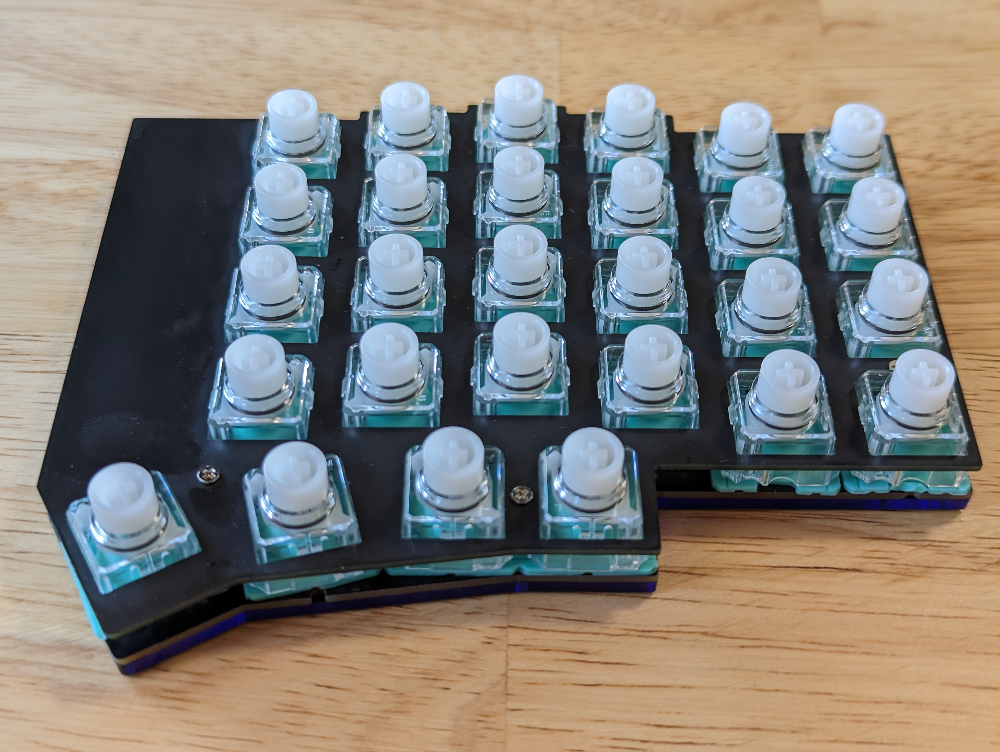

# Firmware for a [Corne-eec](https://github.com/daehyeok/Corne_EEC)

 Rust [Embassy](https://github.com/embassy-rs/embassy) + [Keyberon](https://github.com/TeXitoi/keyberon)
based Split Electrostatic Capacitive Keyboard firmware.

 
 
# Hardware

 Check out [Corne-eec](https://github.com/daehyeok/Corne_EEC) for PCB and other hardwares.

# TODO
- USB DFU with [embassy-boot](https://docs.embassy.dev/embassy-boot/git/default/index.html)
- Per key calibration with live update.
- Live key mapping.
- Support LCD, Rotary Encoder.

# Credit & Reference.

- [tomsmalley/custom-topre-guide](https://github.com/tomsmalley/custom-topre-guide)
- [Cipulot](https://github.com/Cipulot)'s nice multiple PCB and Firmwares.
